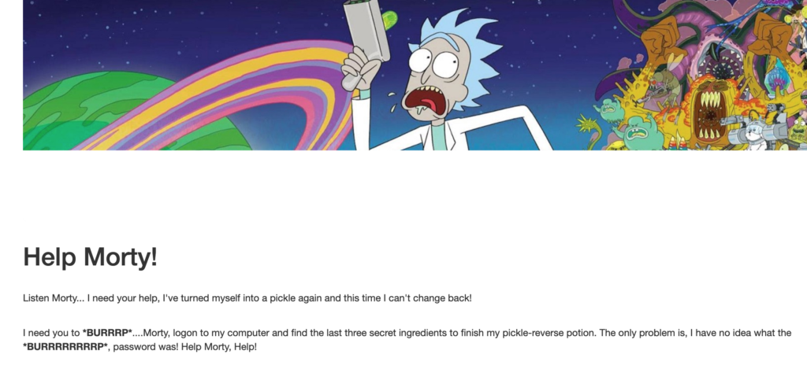
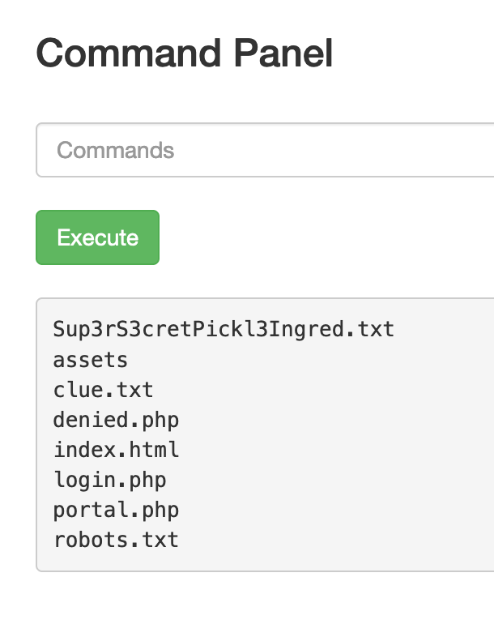
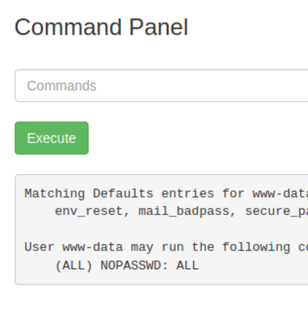
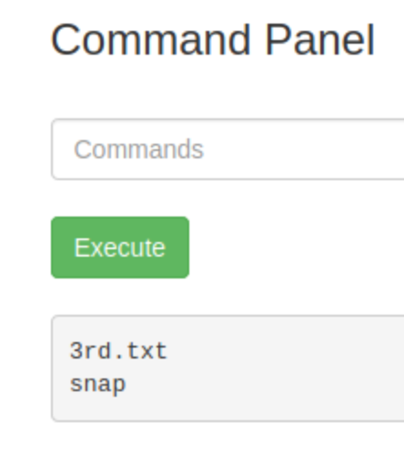

## Introduction

This is another CTF in [Try Hack Me's](https://tryhackme.com) Starter Series. The story behind the challenge is that Rick turned himself into a pickle, and you need to find the three ingredients (flags) that will turn him back into a person. I've only seen a few episodes of Rick and Morty, but I know this challenge comes from one of the episodes in the show. The three ingredients are hidden behind a webpage that you have no credentials to log into and no visible place to log in if you did. They will have to be found during the challenge. One final note, this writeup has the flags/credentials replaced with `<REDACTED>` in accordance with Try Hack Me's policies, so that is why you'll see that a lot below.

## Enumeration

As always, the first step is enumeration. Pulling up the website shows the basic steps of the challenge: find the password, locate the ingredients, and turn Rick back to a human:

There's still nowhere to use it, but it's good to jot down for later. The login page will have to be located first, so that will be the next step. Using `gobuster`, `dirb`, and `nikto` didn't show anything crazy initially except for the existence of a `robots.txt` page:

root@ip-10-10-115-118:~# gobuster dir -u http://10.10.9.26 -w /usr/share/wordlists/SecLists/Discovery/Web-Content/directory-list-2.3-small.txt 
===============================================================
Gobuster v3.0.1
by OJ Reeves (@TheColonial) & Christian Mehlmauer (@\_FireFart\_)
===============================================================
\[+\] Url:            http://10.10.9.26
\[+\] Threads:        10
\[+\] Wordlist:       /usr/share/wordlists/SecLists/Discovery/Web-Content/directory-list-2.3-small.txt
\[+\] Status codes:   200,204,301,302,307,401,403
\[+\] User Agent:     gobuster/3.0.1
\[+\] Timeout:        10s
===============================================================
2022/06/24 19:10:00 Starting gobuster
===============================================================
/assets (Status: 301)
===============================================================
2022/06/24 19:10:15 Finished
===============================================================
root@ip-10-10-115-118:~# dirb http://10.10.9.26

-----------------
DIRB v2.22    
By The Dark Raver
-----------------

START\_TIME: Fri Jun 24 19:10:29 2022
URL\_BASE: http://10.10.9.26/
WORDLIST\_FILES: /usr/share/dirb/wordlists/common.txt

-----------------

GENERATED WORDS: 4612                                                          

---- Scanning URL: http://10.10.9.26/ ----
==> DIRECTORY: http://10.10.9.26/assets/                                       
+ http://10.10.9.26/index.html (CODE:200|SIZE:1062)                            
+ http://10.10.9.26/robots.txt (CODE:200|SIZE:17)                              
+ http://10.10.9.26/server-status (CODE:403|SIZE:298)                          
                                                                               
---- Entering directory: http://10.10.9.26/assets/ ----
(!) WARNING: Directory IS LISTABLE. No need to scan it.                        
    (Use mode '-w' if you want to scan it anyway)
                                                                               
-----------------
END\_TIME: Fri Jun 24 19:10:32 2022
DOWNLOADED: 4612 - FOUND: 3
root@ip-10-10-115-118:~#
root@ip-10-10-115-118:~# nikto -h http://10.10.9.26
- Nikto v2.1.5
---------------------------------------------------------------------------
+ Target IP:          10.10.9.26
+ Target Hostname:    ip-10-10-9-26.eu-west-1.compute.internal
+ Target Port:        80
+ Start Time:         2022-06-24 19:12:32 (GMT1)
---------------------------------------------------------------------------
+ Server: Apache/2.4.18 (Ubuntu)
+ Server leaks inodes via ETags, header found with file /, fields: 0x426 0x5818ccf125686 
+ The anti-clickjacking X-Frame-Options header is not present.
+ No CGI Directories found (use '-C all' to force check all possible dirs)
+ "robots.txt" retrieved but it does not contain any 'disallow' entries (which is odd).
+ Allowed HTTP Methods: OPTIONS, GET, HEAD, POST 
+ Cookie PHPSESSID created without the httponly flag
+ OSVDB-3233: /icons/README: Apache default file found.
+ /login.php: Admin login page/section found.
+ 6544 items checked: 0 error(s) and 7 item(s) reported on remote host
+ End Time:           2022-06-24 19:12:40 (GMT1) (8 seconds)
---------------------------------------------------------------------------
+ 1 host(s) tested

The `robots.txt` page didn't have any entries, just a string of one of Rick's sayings:

~ » curl https://10-10-9-26.p.thmlabs.com/robots.txt        
<REDACTED>

I checked to see if this was a directory or page, but it was not. Like the username, I just saved this for later. Now, there had to be more that was missing. After some Googling, it seemed that specifying an extension with `gobuster` may show additional things that were missed at first. Once the php extension was added, two new pages appeared:

root@ip-10-10-115-118:~# gobuster dir -u http://10.10.9.26 -w /usr/share/wordlists/SecLists/Discovery/Web-Content/directory-list-2.3-small.txt -x php
===============================================================
Gobuster v3.0.1
by OJ Reeves (@TheColonial) & Christian Mehlmauer (@\_FireFart\_)
===============================================================
\[+\] Url:            http://10.10.9.26
\[+\] Threads:        10
\[+\] Wordlist:       /usr/share/wordlists/SecLists/Discovery/Web-Content/directory-list-2.3-small.txt
\[+\] Status codes:   200,204,301,302,307,401,403
\[+\] User Agent:     gobuster/3.0.1
\[+\] Extensions:     php
\[+\] Timeout:        10s
===============================================================
2022/06/24 19:34:18 Starting gobuster
===============================================================
/login.php (Status: 200)
/assets (Status: 301)
/portal.php (Status: 302)
===============================================================
2022/06/24 19:34:33 Finished
===============================================================
root@ip-10-10-115-118:~# 

There was now a way to move deeper in the challenge.

## Logging In

I thought this step was going to be a much more interesting section with brute forcing and a more technical challenge, but it ended up being super easy. On the first try with the found username and the string from the `robots.txt` page, I was able to successfully log in. So we now had Rick's credentials, and could move onto the next part of the challenge.

## Ingredient One

The webpage showed a command panel where you can input a command and it will execute it (with some restrictions). The first command I ran was `ls` and it showed something interesting in the current directory:

That `Sup3rS3cretPickl3Ingred.txt` looks to be the first thing we need. Now, one of the restriction's I mentioned earlier was that you can't run the `cat` command to display the file. This isn't a problem here because this directory is the one being served by the webserver, so we can use `curl` to see what it's contents are:

~ » curl https://10-10-9-26.p.thmlabs.com/Sup3rS3cretPickl3Ingred.txt
<REDACTED>

## Ingredient Two

Present in the same directory was also a `clue.txt` file. This confirms my suspicions that we would have to investigate the system more in depth to find the other ingredients:

~ » curl https://10-10-9-26.p.thmlabs.com/clue.txt          
Look around the file system for the other ingredient.

Looking at the `/home` directory, there are two users present, rick and ubuntu. Rick seemed like the more obvious choice, so that was where I looked and was able to find the second ingredient present there. The problem was this directory wasn't on the webserver, so I had to use a different trick to get around the `cat` restriction. A way I've used before and like is to use `base64` instead. This encodes any text given to it into base 64 characters, and can also easily be undone. The method was pretty simple. On the CTF machine, the file was encoded like so:

base64 "/home/rick/second ingredient"

This gave the encoded string back, which can be uncoded on my machine in the following manner:

~ » echo <REDACTED> | base64 -d       
<REDACTED>

And with that I had two out of the three ingredients.

## Ingredient Three

I figured the last ingredient would probably be in the `/root` directory, so I needed a way to see in there. To do that, I had to be able to run commands as root. Luckily, after running `sudo -l` I could see the user I was could run any command with `sudo`:

Now it was trivial to list the root directory and confirm the final ingredient was there with `sudo ls /root`:

`cat` still can't be used, but the `base64` trick still works:

\# in the CTF
sudo base64 /root/3rd.txt
\`\`\`
\`\`\`
# My machine
~ » echo M3JkIGluZ3JlZGllbnRzOiBmbGVlYiBqdWljZQo= | base64 -d
3rd ingredients: <REDACTED>

## Closing

That was the final step in the CTF. This isn't a very tough challenge, but that makes sense for it being in the starter series. It definitely seems to show off some of methods and techniques taught in other places on Try Hack Me, so they probably wanted a challenge that highlighted those. All in all though it's a not super realistic challenge but was fun even for someone who hasn't really seen the show.
