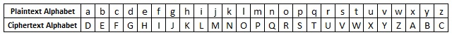

## Intro to the Caesar shift

No you're not just missing projects 1-5. I decided to get back into this project (more on the project [here](https://connormurphysecurity.com/projects/100rtp_intro-and-00/)) and wanted to start with one I thought was more fun, so I created a Caesar Shift tool that can be used to encode and decode text. If you don't know about the Caesar cipher you can find more in-depth information out [here](https://en.wikipedia.org/wiki/Caesar_cipher). The basic idea is you just change every letter to be the letter that is n spaces from it in the alphabet. N can be any number mod 26 (the remainder when divided by 26) to either the left or the right. My script uses the same setup as Caesar himself, with the shift being 3 to the right so that A becomes D, B becomes E, and so on. Here is the full encoded alphabet for reference:

## The Code

The code is available on Github here: [https://github.com/Cmurph16/100redTeamProjects/blob/main/05caesarCipher.py](https://github.com/Cmurph16/100redTeamProjects/blob/main/05caesarCipher.py). I've also included it here to go over a few elements of it:

import sys

# function to apply caesar shift
def encode(suppliedInp):
    encodedVal = \[\]
    for letter in suppliedInp:
        # skipping spaces because it just makes a lot of #'s
        if letter == ' ':
            continue
        # adds shift value (default shift = 3) to number value of letter and switces back to letter
        encodedVal.append(chr(ord(letter)+3))
    # return string of the shifted array
    return ''.join(encodedVal)

def decode(message):
    decodedVal = \[\]
    for letter in message:
        # remove the shift value from the unicode number with the letter
        decodedVal.append(chr(ord(letter)-3))
    # return string of the unshifted array
    return ''.join(decodedVal)

def main():
    # if no encode or decode flag sent in
    if (len(sys.argv)<2):
        print('Need to supply an e or d flag to either (e)ncode or (d)ecode')
        sys.exit(0)
    # if the first argument isn't an encode or decode flag
    if (sys.argv\[1\].lower() != 'e' and sys.argv\[1\].lower() != 'd'):
        print('The first argument needs to be either an e or d flag to either (e)ncode or (d)ecode')
        sys.exit(0)
    # encode loop
    if (sys.argv\[1\].lower() == 'e'):
        if (len(sys.argv)>2):
            # passed in message with cli
            caesar = encode(sys.argv\[2\])
        else:
            # no message passed in. Prompting user
            suppliedInp = input("Message to encode: ")
            caesar = encode(suppliedInp)
        print('Caesar encoding: {}'.format(caesar))
    else:
        # decode loop
        if((len(sys.argv)>2)):
            # passed in message with cli
            decodedMes = decode(sys.argv\[2\])
        else:
            # no message passed in. Prompting user
            suppliedInp = input("Message to decode: ")
            decodedMes = decode(suppliedInp)
        print('Decoded message: {}'.format(decodedMes))

# default script stuff
if \_\_name\_\_ == '\_\_main\_\_':
    main()

One thing you may notice right away in the encoding section is there is that it removes all spaces. The reason for that may not be immediately apparent, but I hope this example will illustrate it. If you are encoding the phrase "meet at nine oclock", with no spaces you will get "phhwdwqlqh". Imagine you are back in time when the Caesar shift was not well known and methods such as [frequency analysis](https://en.wikipedia.org/wiki/Frequency_analysis) did not exist. This ciphertext would not give you that much information about the plaintext. In contrast, take the ciphertext "phhw#dw#qlqh" (# is what you get when you Caesar shift from a space using Unicode and the [ord](https://beginnersbook.com/2019/03/python-ord-function/) function). It doesn't take a giant leap to guess what the # is in this context.

If you knew it was about a meeting, you may get even luckier. Even though you don't know the time, there are only three possible hours it can be. Why is that you ask? The answer is that you now know the length of the words. Dw, the second ciphertext word, has a length of 2. No hour written out fully has a length of 2, so we know this isn't the time. Yes I know it could be with numbers or otherwise encoded, but this is just a simple example. The other two words have a length of 6. Only three hours (four, five, and nine) share this length. Because the spaces were included, just knowing the fact this was about a meeting leaked so mush info that it narrowed the possible times to three hours.

Outside of the space issue, the rest of the code should be pretty straightforward. You encode the messages with an e flag added, and decode them with d. The program will also prompt you for the message if all you supply is the flag.

## Examples of Caesar shift tool in action

~/Documents/100ReadTeamProjects (main) » python3 05caesarCipher.py e "meet at nine"                        
Caesar encoding: phhwdwqlqh
---------------------------------------------------------------------------------------------------------------------------------
~/Documents/100ReadTeamProjects (main) » python3 05caesarCipher.py e "test"                                    
Caesar encoding: whvw
---------------------------------------------------------------------------------------------------------------------------------
~/Documents/100ReadTeamProjects (main) » python3 05caesarCipher.py d phhwdwqlqh                                
Decoded message: meetatnine
---------------------------------------------------------------------------------------------------------------------------------
~/Documents/100ReadTeamProjects (main) » python3 05caesarCipher.py d whvw                                      
Decoded message: test
---------------------------------------------------------------------------------------------------------------------------------
~/Documents/100ReadTeamProjects (main) » python3 05caesarCipher.py e                                        
Message to encode: "hello"
Caesar encoding: khoor
---------------------------------------------------------------------------------------------------------------------------------
~/Documents/100ReadTeamProjects (main\*) » python3 05caesarCipher.py e                                     
Message to encode: test
Caesar encoding: whvw

## Final note

The part on prompting only works correctly in python3. It has to do with the way input() saves user input differently between python2 and python3. I use python3 for most things and is recommended, so this bug wasn't a high priority for me. Just use python3 and everything should work fine.
